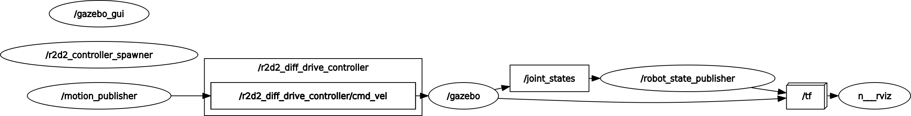

# Simulated Differential Robot

## Table of Contents

- [About](#about) <!-- - [Getting Started](#getting_started) -->
- [Usage](#usage)
- [Thanks](#Thanks)

## About <a name = "about"></a>



This project includes a setup for the simulation of a differentiable robot in Gazebo. An overview of ROS node graph as above.


## Usage <a name = "usage"></a>

Set the environment variables
```
source /opt/ros/noetic/setup.bash
source <path_to_your_workspace>/devel/setup.bash
```
To setup the simulation environment(start Gazebo with Rviz and spawn the robot):
```
roslaunch simulate_robot setup_env.launch
```
or 
```
roscd simulate_robot
./script/run_setup.sh
```
To launch the motion publisher to control the robot (a command publisher node sending cyclic velocity commands with 10 Hz):

```
roslaunch simulate_robot motion_publisher.launch 
```
or 
```
roscd simulate_robot
./script/run_motion_publisher.sh
```

the velocity is configurable under ```/config/motion.yaml```

or launch the both in one line

 ``` roslaunch simulate_robot toplevel.launch  ```
 or 
```
roscd simulate_robot
./script/run_simulation.sh
```

## Thanks <a name = "Thanks"></a>

we adopted URDF file from [urdf_sim_tutorial](https://github.com/ros/urdf_sim_tutorial) for the differentiable robot.

 